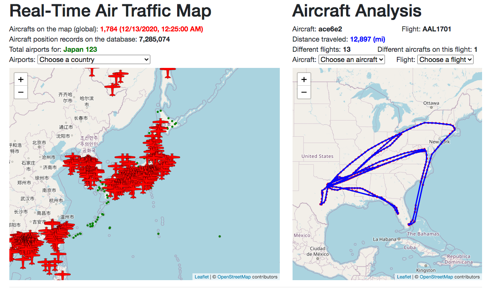
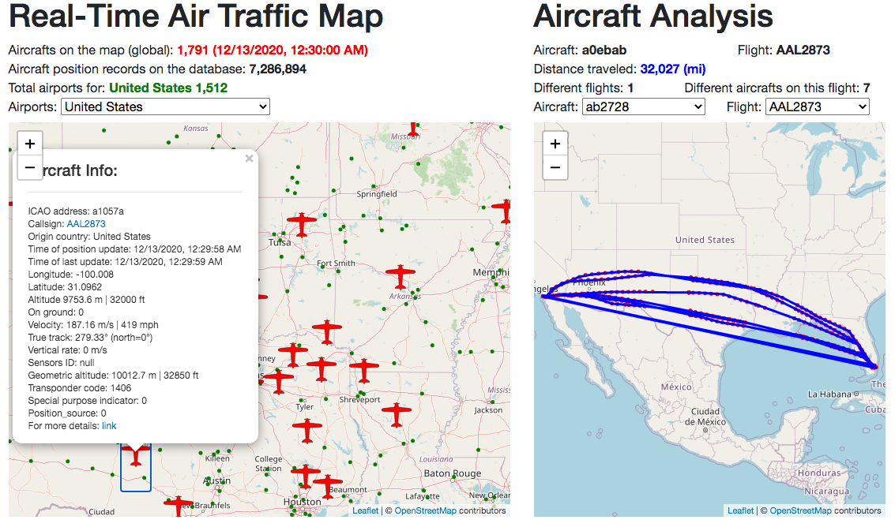
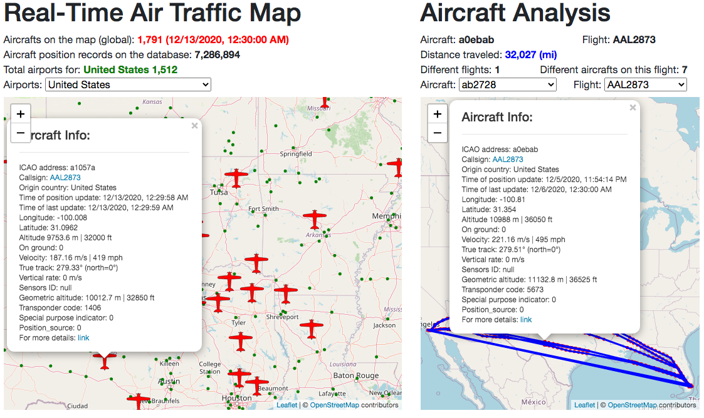
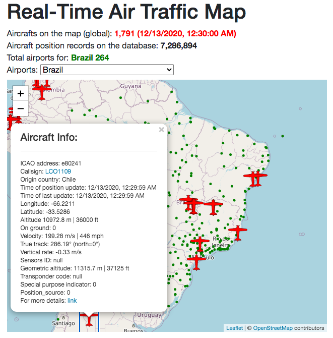
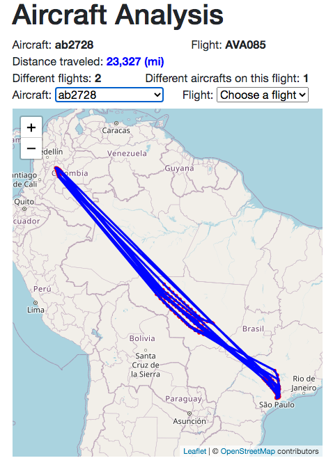
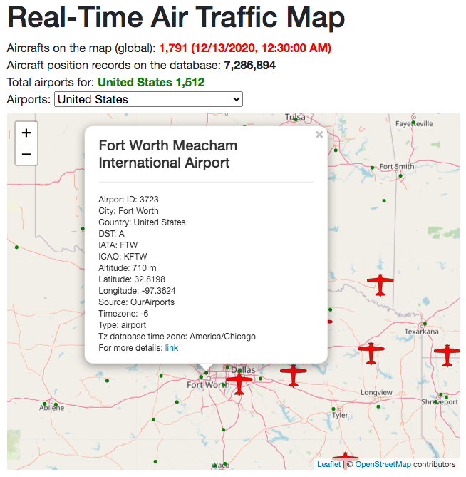
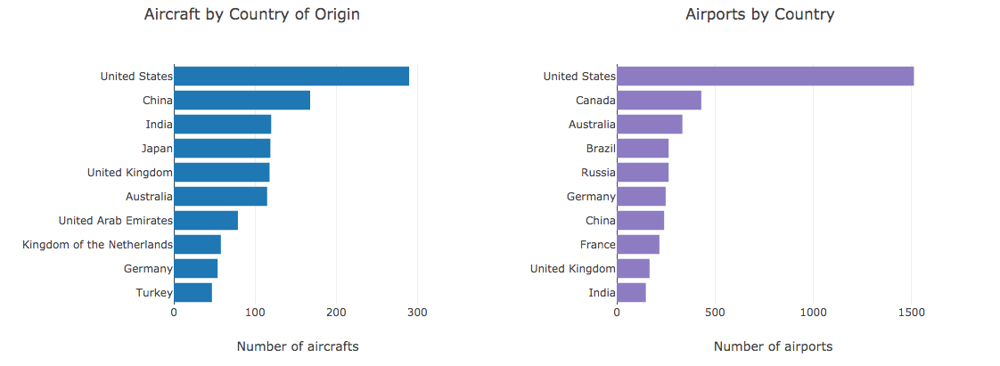
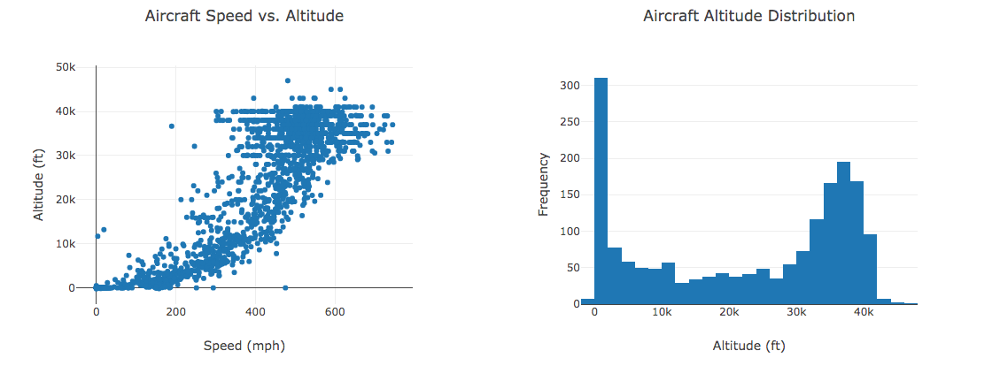
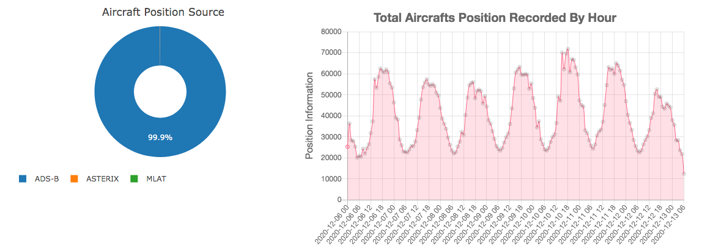

# 18 Project 2: Global Air Traffic Live Tracker

## Rice University Data Analytics and Visualization Boot Camp 2020

This repository contains the following scenario:
 

## Airtraffic Live Dashboard

This project consists in the creation of a web application dashboard that provide real-time information about the global air traffic. The main view of the dashboard is the following.

The project was deployed in two version. A light version using only JavaScript/HTML/CSS that tracks only real time results that can be accesed [here](https://gpivaro.github.io/Project_2/). The full version of this project has a back-end compose of Python and MySQL and it is available [here](https://airtraffic-live.herokuapp.com/).
 
 ---

### Data Source

The main data source to build our live tracker dashboard is the free API from [The OpenSky Network](https://opensky-network.org/). A short description of the The OpenSky Network is the following.

The OpenSky Network [live REST API](https://opensky-network.org/api) provides JSON object with geolocation info about the aircrafts using [Automatic Dependent Surveillance–Broadcast (ADS-B)](https://en.wikipedia.org/wiki/Automatic_Dependent_Surveillance%E2%80%93Broadcast). This project queries the The OpenSky Network API every 5 min for the full version of this [dashboard](https://airtraffic-live.herokuapp.com/) and every user access for the [light version](https://airtraffic-live.herokuapp.com/).

Besides the live data described above, this application utilizes airport information based on the data available [here](https://raw.githubusercontent.com/jpatokal/openflights/master/data/airports.dat).

### Dashboard Visualizations

The main functionality of the dashboard is two maps shown at the top of this page. The dashboard is intended to provide means for the user access several different information as described below.

* Maps view:

Left MAP: The user has access to the number of aircrafts currently on the map (global, not only on the selected view) and the time of the last updated information. Below that, the user has access to the total number of aircraft messages that are currently stored on the database. Right below, the user has a dropdown menu to select a Country to be displayed on the map. Once the country is selected, the country name and the total of airports for that country are displayed on the line abover. On the map, the user can either select an aircraft of an airport to obtain more information about it.

Right Map: The user has the information about one specific aircraft. On the first line, the aircraft unique ICAO24 address and the current flight are displayed. The next line shows how many miles that aircraft was travalled based on the data available in this application database. The following line displayes how many different flight that aircraft was and the how many different aircrafts were in that fligth. Underneath that, the user has two dropdown menus to select an aircraft or a fligth to be updated on the map.

#### Aircrafts and Airports by Country

#### Altitude and Speed Relationship

#### Position Source And Live Aircraft Distribution

---

### How to Install

* [Data base creation](Database)

* [Query API and update database](scripts)

* [Flask web server](app.py)

* [HTML](templates)

* [Javascript](static)

---

### Expansion Opportunites

There are many air traffic data sources that were found while preparing this dashboard that were not explored. The following list some of the resources that can provide more data points to expand this work. 

* [Openflights.org](https://openflights.org/data.html#airport) - Airport, airline and route data;

* [Airport-data.com](https://www.airport-data.com/) and [Airport-data.com/api](https://www.airport-data.com/api/doc.php) - Extensive Aircraft Data;

* [flyingnut.com](http://www.flyingnut.com/adsbmap/grids/aircraft.html) - ADS-B observations;

* [Adsbexchange](https://www.adsbexchange.com/) - World's largest source of unfiltered flight data; [Adsbexchange aircraft list API](https://public-api.adsbexchange.com/VirtualRadar/AircraftList.json) - Aircraft json data; [ADSBexchange.com API](https://rapidapi.com/adsbx/api/adsbexchange-com1)

* [Virtual Radar Server](http://www.virtualradarserver.co.uk/Documentation/Formats/AircraftList.aspx) - This JSON file reports on the state of all of the aircraft tracked by a receiver or merged feed;

* [Flightaware](https://flightaware.com/live/) - Real-time worldwide flight traffic; [Flightaware](https://flightaware.com/resources/registration/) - Use the registration number (N...) to search for aircraft;

* [avionictools](http://www.avionictools.com/icao.php)  - Convert a US aircraft registration (N Number) to the corresponding ICAO address

#### Next Steps:

* Associate the aircrafts with the airports (to/from);

* Track the airports traffic;

* Add layer for weather;

* Add a search field to the user search by aircraft or airport;

* Add stats for individual flights and airports.

